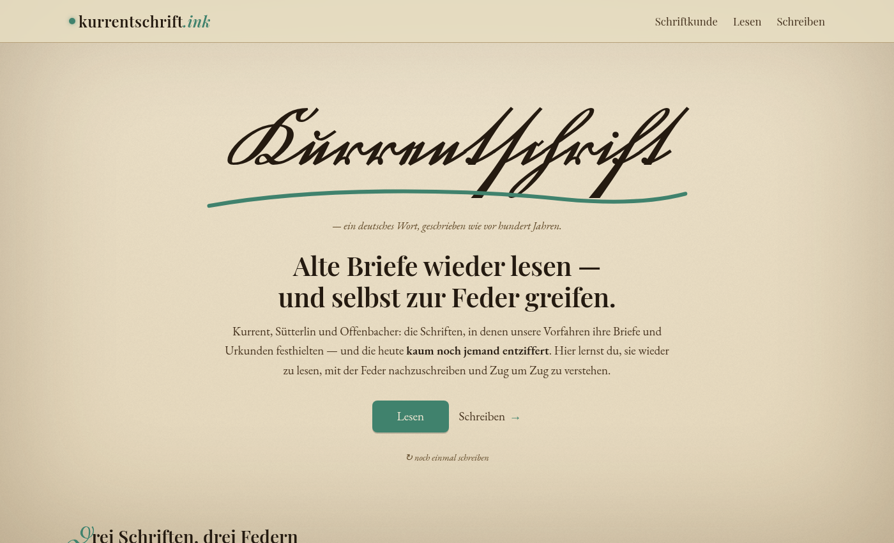

# kurrentschrift

[](LICENSE)
[](https://github.com/MarkusNeusinger/kurrentschrift/actions/workflows/ci.yml)
[](https://codecov.io/github/MarkusNeusinger/kurrentschrift)
[](docs/concepts/architektur.md)

> Reading and re-inking historical German Kurrent script via ductus-model template fitting on scans.

[](https://kurrentschrift.ink)

**[→ Try it live at kurrentschrift.ink](https://kurrentschrift.ink)**

## What you can use today

The live site is organised into three areas — Schriftkunde (reference), Lesen (reading) and Schreiben (writing):

- **Script overview (Schriftkunde)** — a compact, fully sourced introduction to the German cursive scripts (Kurrent · Sütterlin · Offenbacher), their nibs, ink and letter quirks.
- **Letter quiz** — learn to read the alphabet one glyph at a time.
- **Writing board (Tafel)** — specimen rows on ruled lines, written stroke by stroke as a tracing model.
- **Practice-sheet generator** — printable worksheets with configurable ruling (Lineatur) and your own text.
- **Live writer (Federprobe)** — type any word or sentence and watch the synthesised Sütterlin ductus write it, connecting strokes included.

Everything below is the engine being built behind them.

## The idea

Two problems live under "historical German handwriting":

1. **Read it** — already solved. [Transkribus](https://transkribus.org/) ships public Kurrent models at ~5–7% CER. Integration, not research.
2. **Write it — so the output looks like ink, not a font.** No off-the-shelf product exists. That's the project.

The hard part of writing is the **crossing problem**: from a still image of cursive script, the skeleton alone can't tell which stroke passed under which at a loop crossing. OpenType fonts fake the connections and never look inked; ML stroke-synthesis needs *online* pen-path data, but historical material is image-only.

**The approach — analysis-by-synthesis with a ductus prior.** The image supplies geometry and ink width; the *ductus* (stroke order and pen-lift points, known a priori for normed pre-1900 Kurrent) supplies the missing dimension. A canonical ductus template is fitted to the scan's skeleton and distance-transform profile. The library unit is `(glyph, position, variant)` — medial `ſ` and final `s` are different glyphs, not one `s` with a context switch — and transitions fall out of `exit`/`entry` tangents, so there is no bigram explosion.

The open research question is how tight to make the template: too rigid won't fit real hands; too loose and the crossing ambiguity returns. Finding that trade-off empirically is the project's research kernel.

## Status

In-progress MVP.

- **Live** on [kurrentschrift.ink](https://kurrentschrift.ink): the script overview (`/schriftkunde`), the letter quiz and the writing board under *Lesen*, and the worksheet generator and the Federprobe live writer under *Schreiben*.
- **Built:** the admin setup wizard, canonical glyph extraction, the template-to-instance fit routine, and server-side word composition — text → glyph sequence → placed glyphs with generated connecting strokes (`core/shaping.py` + `core/compose.py`, served as `GET …/write/word`, scored against period word specimens by the `tools/wordbench` benchmark).
- **Next milestone:** scan the author's own hand for a small lowercase alphabet (`a d e l n ſ s`) plus a few words, fit the canonical ductus per glyph, aggregate, then re-render those words *and at least one new word* in the same hand. Four validation gates — stability, allograph separation, word rendering, animation playback — decide "kernel validated" vs. a fast, useful negative result. See the [§8 MVP](docs/concepts/architektur.md#8-der-mvp-kleinster-lauffähiger-renderkern) and the [MVP roadmap](docs/concepts/mvp-roadmap.md).

Beyond the kernel, the roadmap sequences reading help (HTR), style analysis, hand comparison, and a possible open-data release — see [`architektur.md` §10](docs/concepts/architektur.md#10-reihenfolge--post-mvp-roadmap).

## Project structure

```
kurrentschrift/
├── core/       # Pure-Python compute + DB layer (extractor, template, Postgres models)
├── api/        # FastAPI service (thin routing over /core)
├── app/        # React 19 + Vite + MUI SPA — public site + admin behind /admin/*
├── alembic/    # Schema migrations
├── data/       # Sources, variants, samples (separate licensing — see below)
└── docs/       # Design rationale (German); references with technical specs
```

### Local dev

```bash
uv run alembic upgrade head                              # once, or when the schema changes
uv run uvicorn api.main:app --reload --port 8000         # Python backend on :8000
cd app && npm install && npm run dev                     # Vite dev server on :3000 (/api proxy)
```

Open `http://localhost:3000`. The admin lives under `/admin` (Cloudflare Access in production). Point `DATABASE_URL` (see [`.env.example`](.env.example)) at any empty PostgreSQL database — `alembic upgrade head` creates the schema and seeds the base styles. For local admin saves, set `ADMIN_TOKEN=<x>` on the API and a matching `VITE_ADMIN_TOKEN=<x>` in `app/.env` (without them, write requests return 401).

## Documentation

Design rationale lives in [`docs/`](docs/) — start at [`docs/index.md`](docs/index.md). Highlights: the [vision](docs/concepts/vision.md), the [architecture reference](docs/concepts/architektur.md) (§1–§17), the [MVP roadmap](docs/concepts/mvp-roadmap.md), and reference specs for [HTR integration](docs/reference/htr-integration.md), [animation rendering](docs/reference/animation-rendering.md), [style analysis](docs/reference/styleanalyse.md), and the [frontend stack](docs/reference/frontend-stack.md). Internal docs are German (the domain is German); code, commits, and this README are English.

## Data & licensing

Code is MIT. **Data is not.** Each source under `/data/sources/` carries its own license (see its `SOURCE.md`); corpora live outside git; NC-SA-derived materials never reach committed outputs. The first source is the [Loth 1866 Kurrent table](data/sources/loth-1866/SOURCE.md) (Public Domain Mark 1.0, via Wikimedia Commons) — the geometry baseline for the MVP. Full index in [DATA_PROVENANCE.md](data/DATA_PROVENANCE.md).

## Contributing

This is an in-progress MVP portfolio project — issues (including discussion of the approach) are welcome; external PRs are premature until the four MVP gates land. See the **[Contributing Guide](docs/contributing.md)** for what's useful to send right now.

## License

**Open-core.** The code is MIT — see [LICENSE](LICENSE). The **learned data** this project produces — the curated glyph templates, the ductus, and the script statistics / trained reading models built in the admin — is **not** covered by MIT and stays reserved, even with the repo public; reuse by arrangement only. The public-domain sources under `/data/` keep their own free license. If the methodology is useful to your work, see [CITATION.cff](CITATION.cff).

---

**Built by [Markus Neusinger](https://linkedin.com/in/markus-neusinger/)**
